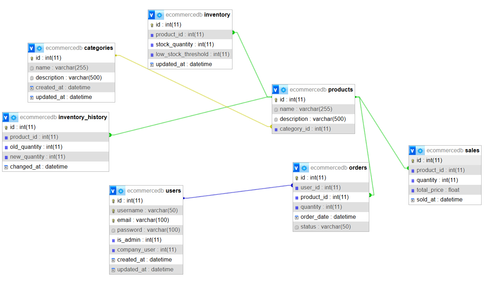

# Ecommerce Backend
## Setup Instructions

#### Install All Packages
I have created a requirement file with the name of requirements.txt.
Please run the below command to install the packages

Using Python 3.8

```bash
pip install -r requirements.txt
```

#### Script to Populate Database Tables
I have created the schema for MySql databases and a seeder file to create and populate the database tables. 

```bash
python databaseSeeder.py
```

## Database
#### User
This table has the user information in it. For simplicity I am using the same table to store customer and company users. 
The company_user field is its identifier. 
If the user is company user and is_admin field is also true, then they would be able to login to this dashboard and use it. 

#### Category
This table registers all the categories that a product could belong to. For example: Electronics, Food, Toys, e.t.c. 

#### Product
This table has all the products that are, or have been listed on the store in the past. 

As mentioned above, each product belongs to a category. 

#### Inventory
This table holds the quantity and status of the availability of the product. 

It has a field low_stock_threshold, which has a value already assigned by the admin, if the quantity falls below this, the admin would be notified on the dashboard. For this I have created the get-low-stock endpoint. 

#### Inventory History
I have created this table to track the changes in inventory overtime. If a user updates soemthing in the inventory a row with be appended in this table. 

#### Sales
This table hold the data regarding my sale history. It records the quantity, amount and time of the sale of the product. 

This table is really important for the dashboard as I have used it to calculate revenue in a timeperiod, compare sales and fetch the sales data. 

### Database Schema Diagram

Below is the database schema diagram for the Ecommerce Backend:

